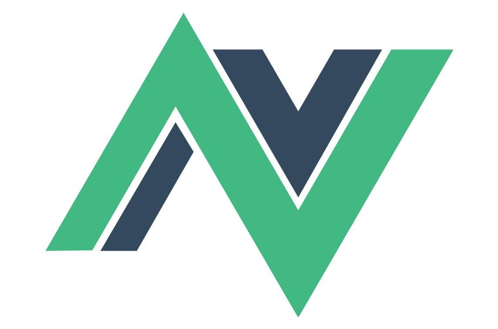
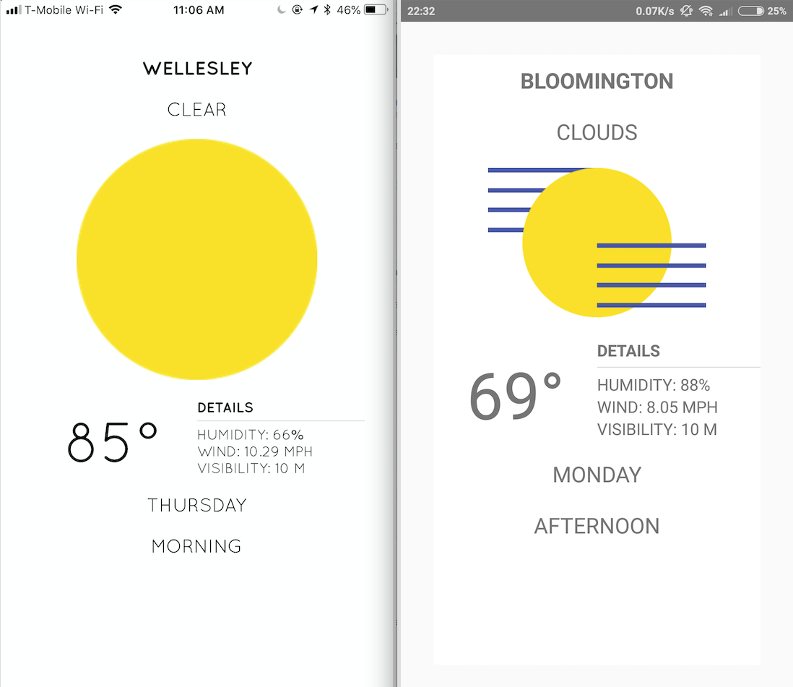
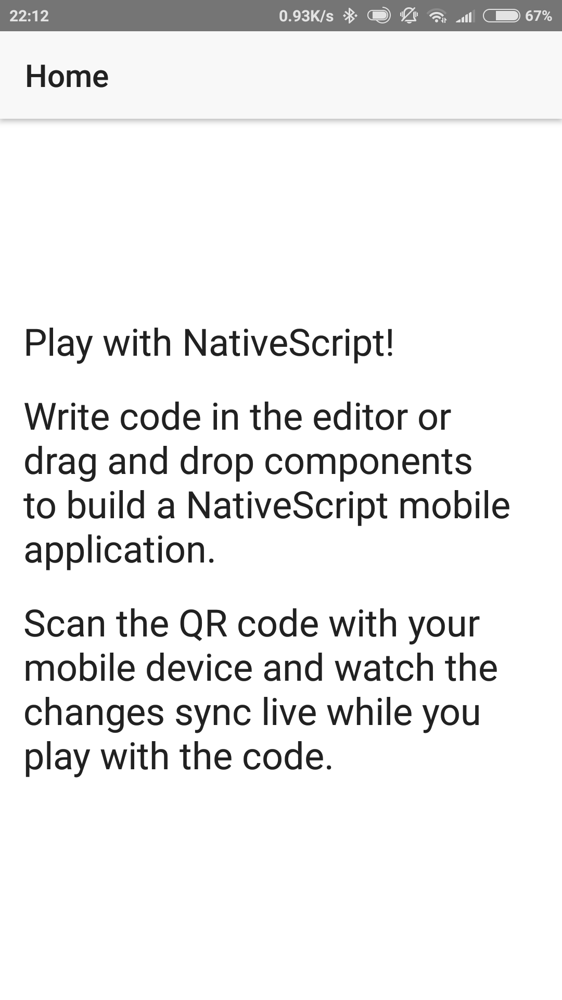

## Lesson 1. Getting Started with NativeScript-Vue

We know we can use Angular to build NativeScript apps, or simply build with "vanilla" NativeScript using JavaScript or TypeScript. But did you know that, due to an amazing community effort led by Developer Expert Igor Randjelovic, we can now use Vue.js as a framework around which to build our apps? Vue.js is an up-and-coming, lightweight JavaScript framework that is gaining in popularity. Learn more about Vue.js [here](https://vuejs.org) and about NativeScript-Vue [here](https://nativescript-vue.org).

In this tutorial, we are going to build a simple weather app, based on a design by  [Gabriel Nazoa](https://www.behance.net/gallery/22645245/Weather-app). 

This weather app, which we'll call "CleanWeather", will allow us to learn how to use geolocation in NativeScript-Vue to get latitude and longitude, and we will use the [OpenWeatherMap](https://openweathermap.org/api) REST API to get that location's weather. In the end, this app will look like this:

Building a weather app is a great proof-of-concept for any mobile app framework, so let's get started. 

> **TIP**:
> * If you run into problems working through this guide, [Stack Overflow](https://stackoverflow.com/tags/nativescript/info) is a great place to reach out for help.

### Step 1. Getting Started with NativeScript-Vue Playground

NativeScript Playground is a browser-based environment for developing simple NativeScript apps. It’s a great place to get started learning NativeScript, as you can develop apps without needing to install the various SDKs and tools needed for native iOS and Android development. All you need to complete this guide is an iOS or Android device. You can follow the [NativeScript-Vue Playground tutorial](https://nativescript-vue.org/en/docs/getting-started/playground-tutorial/) to run apps on your device using the Playground. 

Let’s see the Playground in action.

#### Action

* **a.** Get out an Android or iOS device. You need at least one device to complete this tutorial.

* **b.** Download and install the **NativeScript Playground** app on your device by either searching for “NativeScript Playground” in the iOS App Store or Google Play, or by using the links below.

* **c.** Download and install the **NativeScript Preview** app on your device by either searching for “NativeScript Preview” in the iOS App Store or Google Play, or by using the links below.

* **d.** Open the **NativeScript Playground** app on your device(s), and click the **Scan QR code** action.

* **e.** In your web browser, click the **QR Code** button at the top of the Playground interface.

* **f.** Scan the QR code in your browser with your device; you should see an app that looks like the screenshots below.

One of the biggest benefits of using NativeScript is the fast development workflow. You have the ability to change your code and see those changes instantly—even on multiple devices.

> **TIP**:
> * You can save your current Playground work by clicking the **Save** button at the top. This will generate a URL that you can bookmark for future use.
> * If you want to continue developing this app locally, you can use the **Download** button at the top of the screen. After you download the app you can continue developing using [NativeScript Sidekick](https://www.nativescript.org/nativescript-sidekick) or the [NativeScript command-line interface](https://docs.nativescript.org/start/quick-setup).

And with that, you’re running your first NativeScript app on your device! Now that you have your app up and running, let’s proceed to build our CleanWeather app.
