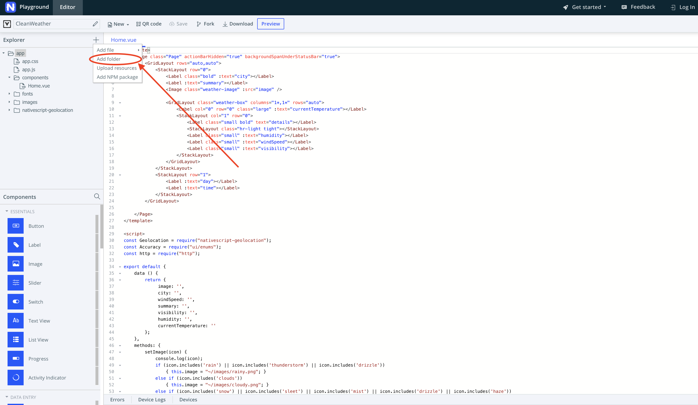

## Lesson 4. Completing the UI

The last thing we need to do is to display an image according to the current forecast. OpenWeatherMap API sends back an icon name with a forecast, so we can use that to build a nice UI.

### Step 7. Upload Assets

<hr data-action="start" />

#### Action

* **a.** First, you’ll need to create two folders. Click the `app` folder in your explorer and click the `+` button. Add one folder called `images` and another called `fonts`. 



* **b.** Download all the images [here](https://github.com/jlooper/cleanweather/tree/master/app/images) to your local machine (here’s a [`.zip` file with everything in it](https://github.com/jlooper/cleanweather/archive/master.zip)), then upload them by hovering on the images folder, clicking on the three dots that appear, and choosing 'upload resources' option. You can add all the images at once. 

* **c.** Do the same thing with the two fonts found in [this folder](https://github.com/jlooper/cleanweather/tree/master/app/fonts), saving them to `fonts`. Click `ctrl-S` to save all your files.

<hr data-action="end" />

> **TIP**:
> * Your current weather might include terms not handled below, so alter the code below if you find that an image is not displayed. Check the included console.log for the name of the icon that is produced by the API.

### Step 8. Use the Images

<hr data-action="start" />

#### Action

* **a.** Add a `setImage()` method in our script's method section to handle the display of the image in our app. Put this method right under `methods: {`

``` JavaScript
setImage(icon) { 
    console.log(icon); 
    if (icon.includes('rain') || icon.includes('thunderstorm') || icon.includes('drizzle'))
        { this.image = "~/images/rainy.png"; }
    else if (icon.includes('clouds')) 
        { this.image = "~/images/cloudy.png"; }
    else if (icon.includes('snow') || icon.includes('sleet') || icon.includes('mist') || icon.includes('drizzle') || icon.includes('haze')) 
        { this.image = "~/images/foggy.png"; }
    else if (icon.includes('clear'))
        { this.image = "~/images/sunny.png"; }
}, 

```
* **b.** Find the line of code that sets `this.icon` in your `parseResponse()` method. (`this.icon = location.weather[0].description;`) Add the following line of code immediately after that line.

``` JavaScript
this.setImage(this.icon);
```

<hr data-action="end" />

The image will appear, but it may look pretty big!

### Step 9. Style Your App

It's now time to style the app!

<hr data-action="start" />

#### Action

* **a.** Find the existing `<style>` block at the bottom of your `HelloWorld.vue` file, and overwrite it with the code below.

``` CSS
<style scoped>
    Page {
        margin: 30;
    }

    label {
        margin: 10 0;
        font-family: "Quicksand";
        font-size: 20;
        text-transform: uppercase;
        text-align: center;
    }

    .bold {
        font-weight: bold;
    }

    .weather-image {
        margin: 10 50;
    }

    .weather-box {
        margin-top: 10;
    }

    .large {
        font-size: 60;
        vertical-align: top;
    }

    .small {
        font-size: 15;
        margin: 0;
        text-align: left;
    }

    .tight {
        margin: 5;
    }
</style>
```

<hr data-action="end" />

This weather app now looks great! Next steps would include adding a side drawer and the ability to switch between locations. 

Credits: Shantanu Kotambkar, NativeScript Ambassador, and Jen Looper 
