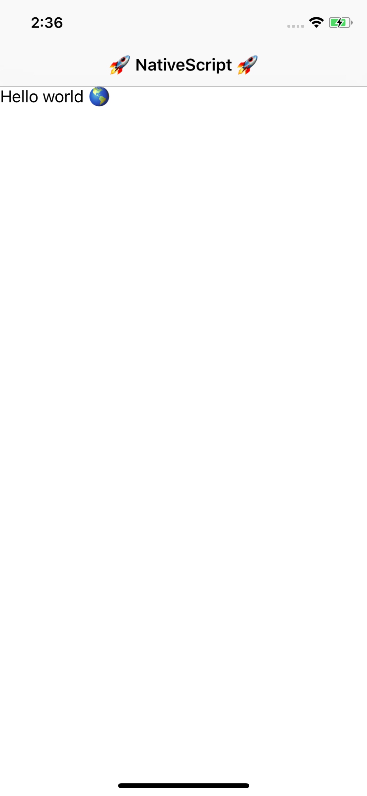
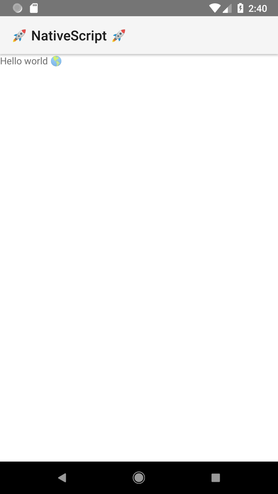
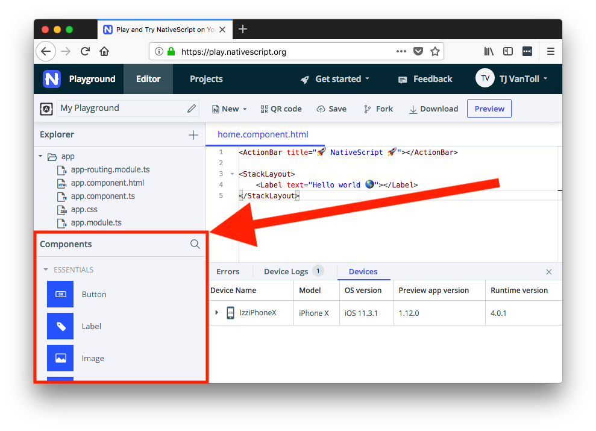
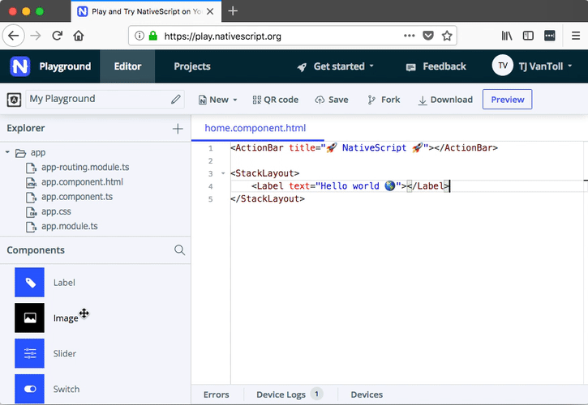
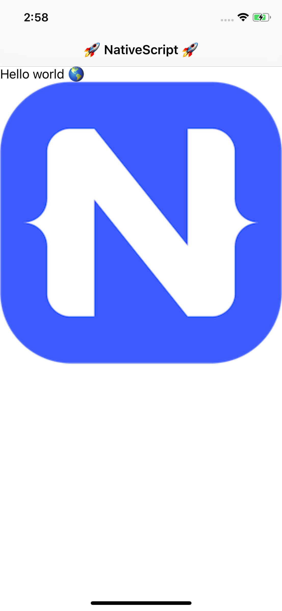
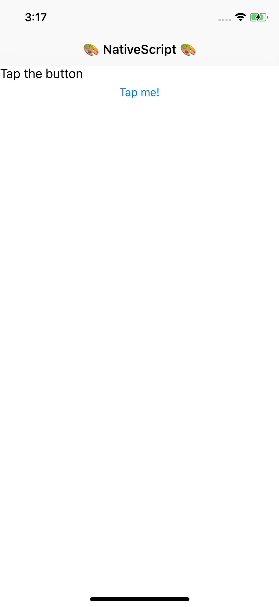
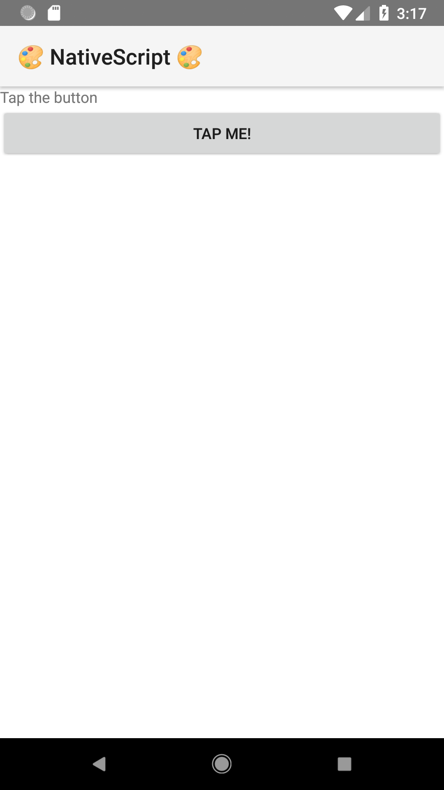
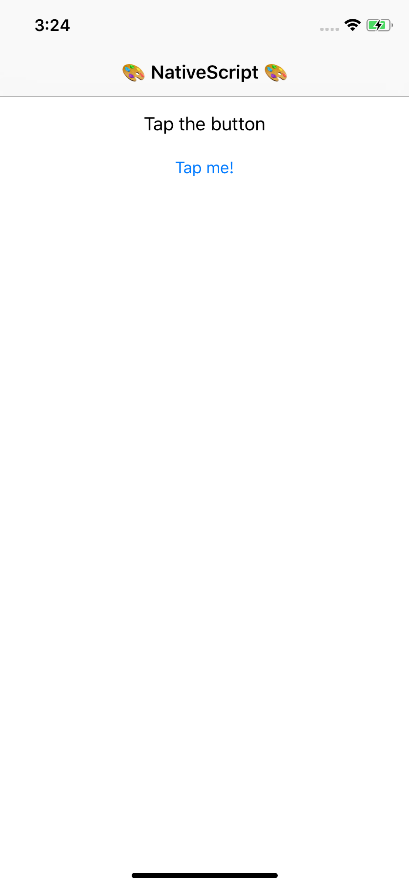
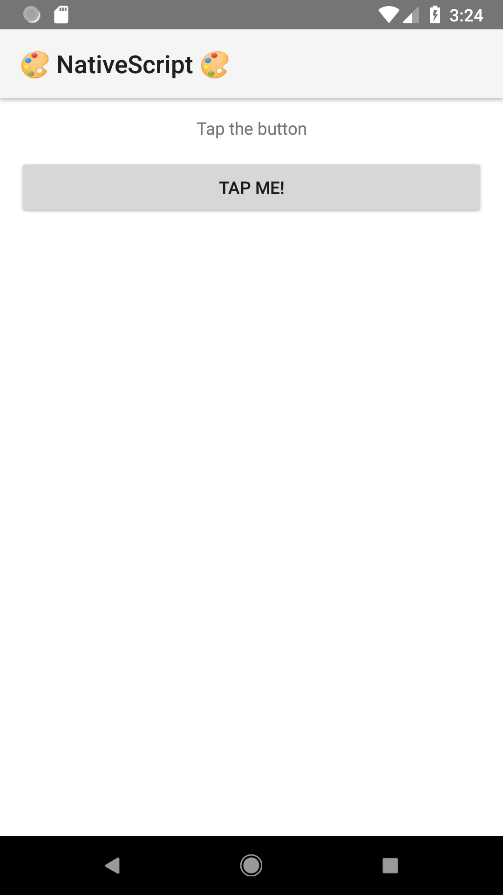

## Lesson 2. Building User Interfaces

NativeScript apps do not use a browser and do not have a DOM; therefore, familiar web elements like `<div>` and `<span>` simply do not work.

Instead, NativeScript provides an [extensive suite of UI elements](http://docs.nativescript.org/ui/ui-views), each of which is implemented with native iOS and Android controls. The advantage of this approach is you get the performance you’d expect from using native user interface components. Let’s look at how they work.

### Step 3. Using NativeScript’s User Interface Components

In this step you’re going to add a few basic user interface components. Let’s start by simplifying the current app.

<hr data-action="start" />

#### Action

* **a.** Open your app’s `app/home/home.component.ts` file and replace its contents with the code below.

``` HTML
<ActionBar title="🚀 NativeScript 🚀"></ActionBar>

<StackLayout>
    <Label text="Hello world 🌎"></Label>
</StackLayout>
```

* **b**. Save your files.

After your app refreshes, you should see the following.




<hr data-action="end" />

This example makes use of three different NativeScript user interfaces components—`<ActionBar>`, `<StackLayout>`, and `<Label>`. Under the hood, NativeScript renders a native iOS and Android control for each of these. For example, NativeScript uses an `android.widget.Toolbar` and `UIView` to render your `<ActionBar>` on iOS and Android, respectively.

NativeScript allows you to configure these native controls through attributes, such as the `<ActionBar>`’s `title` attribute, and the `<Label>`’s `text` attribute.

> **TIP**: You can find a full list of the attributes you can use in the [NativeScript API documentation](https://docs.nativescript.org/api-reference/globals).

The [NativeScript component documentation](https://docs.nativescript.org/angular/ui/components) is a great reference, as it lists each and every component that NativeScript offers out of the box, but let’s look at how you can experiment with these components directly within Playground.

<hr data-action="start" />

#### Action

* **a.** Locate the **Components** pane in Playground.



* **b.** Using your mouse, drag the **Image** component into your `app/home/home.component.html` file, and place it directly after the existing label. Refer to the gif below to see this in action.



* **c.** Save your files. You should now see the following image on your devices.




<hr data-action="end" />

You may want to take a second to experiment with other components in the **Components** pane. When you’re ready, let’s move on to discuss how to control the look of those components.

### Step 4. Styling Your UIs with CSS

NativeScript uses a [subset of CSS](http://docs.nativescript.org/styling) to change the visual appearance of your UI components.

Why a subset? In NativeScript you’re building native iOS and Android apps, and some CSS properties either aren’t possible to replicate with native iOS and Android APIs, or would incur too great of a performance penalty. Don’t worry though; most common CSS properties are supported, and the CSS language syntax is the same—so styling native apps in NativeScript really does feel like styling web apps.

> **TIP**: The NativeScript docs have [a full list of the supported CSS properties you can use](http://docs.nativescript.org/ui/styling#supported-css-properties).

Let’s look at how CSS in NativeScript works by styling your app’s components.

<hr data-action="start" />

#### Action

* **a.** Open your app’s `app/home/home.component.ts` file and replace its contents with the code below.

``` HTML
<ActionBar title="🎨 NativeScript 🎨"></ActionBar>

<StackLayout>
    <Label class="my-label" text="Tap the button"></Label>
    <Button text="Tap me!"></Button>
</StackLayout>
```

* **b.** Save your files. You should see the following UI on your devices.




* **c.** To start to style this app, open your `app/home/home.component.css` file, and replace its contents with the following code.

``` CSS
.my-label {
    margin: 15 0;
    text-align: center;
}
Button {
    margin: 0 15;
}
```




* **d.** Save your files. You should see the following UI on your devices.

<hr data-action="end" />

If you've done any web development before, the syntax should feel familiar here. You select two UI components—one by a class name, and one by a tag name—and then apply a handful of CSS rules as name/value pairs.

What’s so powerful here is remember that you’re not styling `<div>`s and `<span>`s—you’re styling native user interface components, and you’re doing so with for both iOS and Android using a familiar styling language.

But it gets even easier. Let’s look at how you can use NativeScript’s built-in core theme to make your UIs look good with a few CSS class names.

<hr data-action="start" />

#### Action

- Theme

### Step 5. Organizing Your Interfaces with NativeScript Layouts

- StackLayout
- FlexboxLayout
- GridLayout
- nslayouts.com
