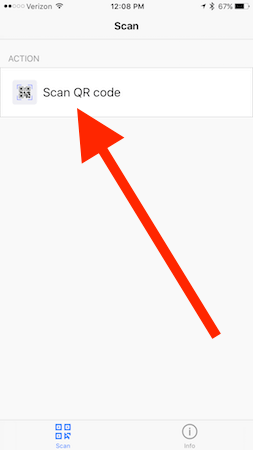
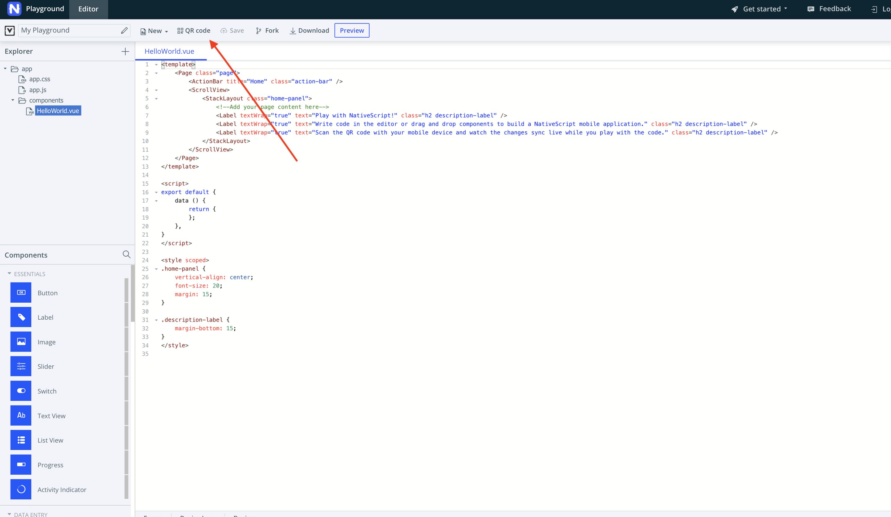
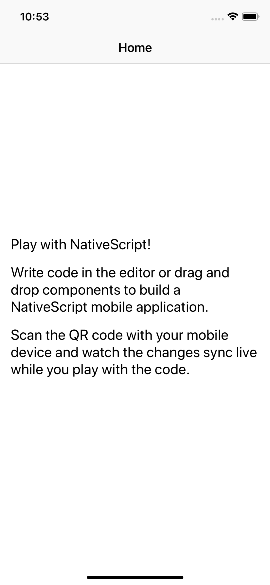
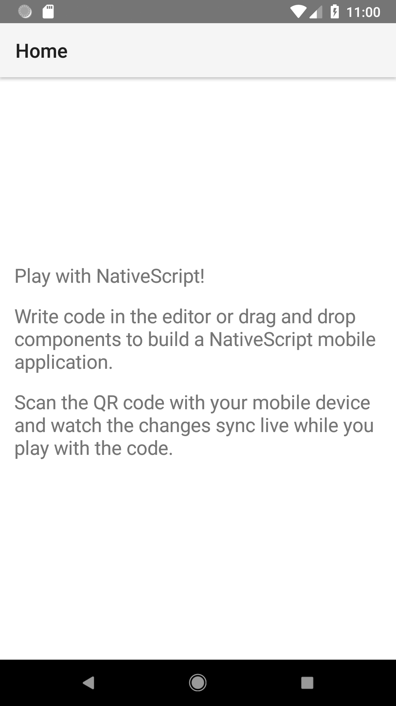
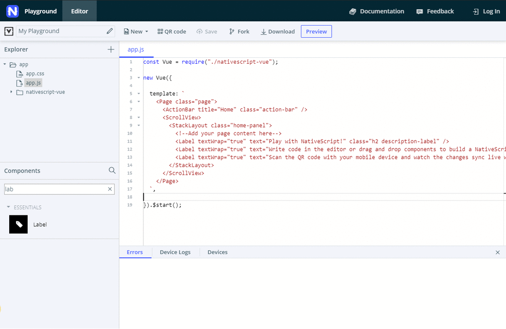
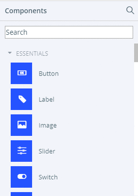
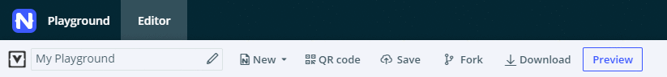

## Lesson 1. Getting familiar with the Playground

Welcome to the NativeScript-Vue getting started experience. In this lesson, you’ll learn how to use the Playground and how to get your very first NativeScript-Vue app running on your device.

> **TIP**:
> * If you run into problems with this tutorial, the [#vue channel in the NativeScript Community Slack](https://www.nativescript.org/slack-invitation-form) is a great place to reach out for help.
> * Thе tutorial pane is collapsible and adjustable. Play around with its size until you find a width that works for you.

### Step 1. The lay of the land

The NativeScript Playground is a browser-based environment for developing simple NativeScript apps with any of the supported integrations. You can get straight to coding without installing the various SDKs and tools needed for native iOS or Android development. All you need to complete this tutorial is an iOS or Android device.

Before you get our hands dirty with actual NativeScript-Vue development, let’s see the NativeScript Playground in action.

#### Action

* **а.** Look around the screen.

The left sidebar offers a file explorer and a **Components** panel. 

* **b.** Explore the file tree.

All work in this tutorial will happen in `components` > `HelloWorld.vue`, where you'll be creating the user interface and the business logic behind it.

* **c.** Check out the **Components** panel in the sidebar.

This panel provides quick access to already pre-configured code for all available NativeScript UI components. You can quickly add components to your app with drag-and-drop.

Through the search box (accessible through the magnifying glass), you can quickly get the components you want to use without scrolling through the list.

* **d.** Examine the top menu bar.

From the top of the page, you can push changes to the preview apps on your device (more about them later), save, and download your code.

* **e.** Get familiar with the bottom of the page.

The bottom of the page is your best friend, providing real-time error reports, device information, and device logs.

### Step 2. Get all the tools

 The Playground might have already prompted you to install a couple of mobile apps&mdash;NativeScript Playground and NativeScript Preview. Together they let you see your code changes applied in real time on device. No code building and bundling required.

Without these apps, you'll miss out on the fun and excitement of playing around with Vue.js and NativeScript on an actual device.

Keep both apps running while you're experimenting with the code.

#### Action

* **a.** Bring out your Android or iOS device. You need at least one device to complete this tutorial.

* **b.** Download and install the **NativeScript Playground** app on your device by searching the App Store or Google Play, or by using the links below.

* **c.** Download and install the **NativeScript Preview** app on your device by searching the App Store or Google Play, or by using the links below.

* **d.** Run the **NativeScript Playground** app on your device and tap **Scan QR code**.

* **e.** In your web browser, in the top menu bar of the Playground, click **QR Code** .

* **f.** Use your device and the currently running QR scanner to scan the QR code from your browser. After a few automatic switches between the apps, you should see an app that looks like the screenshots below.

### Step 3. Drag and drop to code

Adding UI components and the related code-behind logic is as simple as drag-and-drop.

#### Action

* **a.** Check your code editor. Is `components` > `HelloWorld.vue` currently selected? If you can't see its contents in the code editor, select the file from the file tree. Note that you don't need to double-click to open a file for editing.

* **b.** Next, click a component from the **Components** panel and drag it to the code editor, somewhere inside the `<StackLayout>` within the `<template>` block. Releasing the mouse button inserts some pre-written sample code for the respective component. Any methods that go with it (such as what happens on button or item tap) are automatically added below in the `<script>` block. For some components, additional styles are added in the `<style scoped>` block.

> **TIP:** Use the search of the **Components** panel to quickly find the UI component that you want to use. The search works only with the title of the component and not the actual name used in the code. For example: search finds *text field* but does not find *textfield*.
>
> 

* **c.** Explore the `<style scoped>` block. Play with the styles for the newly added component. Experiment with colors and font sizes.

For most UI components to work, you need to drop them inside the `<Page>` section, preferably inside a layout component. Layouts tell your app how to position the UI components on the screen.

> **NOTE:** Right now, there's nothing stopping you from dropping the code at a place that will cause your app to crash or simply not load. In those cases, check the **Errors** and **Device Logs** tabs for more information.

### Step 4. Check it all out real-time

Remember those Playground and Preview apps you downloaded on your device? Now's the time to see them in action.

#### Action

* **a.** After you have placed some component code in a valid spot, hit **Preview** (or `Ctrl+S` or `Cmd+S`) and see your app refresh on your device screen in an instant.

In some cases, when you interact with the app, it will close unexpectedly. Just fire it up again and inspect the crash report. 

If at any point you stop seeing your changes applied on the device, click **QR code** and re-scan the QR code with the *Playground* app.
