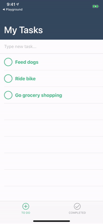
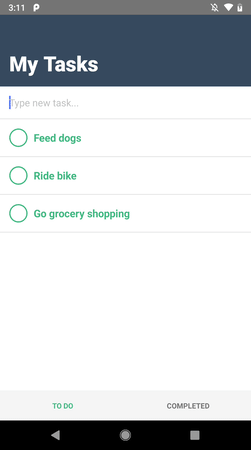

## Lesson 2. Developing an App

### Step 5. Learn what you’re building

All development for this tutorial happens in `components` > `HelloWorld.vue`, containing the front end, the code-behind logic, and all of the styles.

`HelloWorld.vue` begins with a simple `<template>` block consisting of several labels and no connected code-behind logic. As you drag and drop user interface components to the `<template>` block, the Playground populates the `<script>` block.

You'll be working in the `<template>` block to design the user interface, in the `<script>` block to build the app functionality, and in the `<style scoped>` block to adjust some of the styling. 

* The `<template>` block requires NativeScript-compatible markup. 
* The `<script>` block accepts both regular JavaScript, Vue.js-specific, and NativeScript-specific JavaScript.
* The `<style scoped>` block expects CSS, both regular CSS, and NativeScript-specific CSS.

Let's create a simple ToDo app with the following requirements:

* Basic design
  * Two-tab layout
  * One tab shows active tasks and lets you add new tasks
  * Second tab lists completed tasks
* Basic functionality
  * Add tasks: Users can add tasks as text
  * View tasks: Newly added tasks are listed as active and can be tapped
  * Complete tasks: Tapping an active task shows an action dialog with options
  * Delete tasks: Tapping an active or completed task shows an action dialog with options
* Advanced design
  * Input field for adding tasks are styled
  * Tabs are styled
  * Active tasks are styled
  * Completed tasks are styled

At the end your app will look like this.

> **TIP**: The final state of this tutorial is available [here](https://play.nativescript.org/?template=play-vue&id=7hlv5q&v=120), and you can refer to it at any time if you get stuck.

Let’s start building!