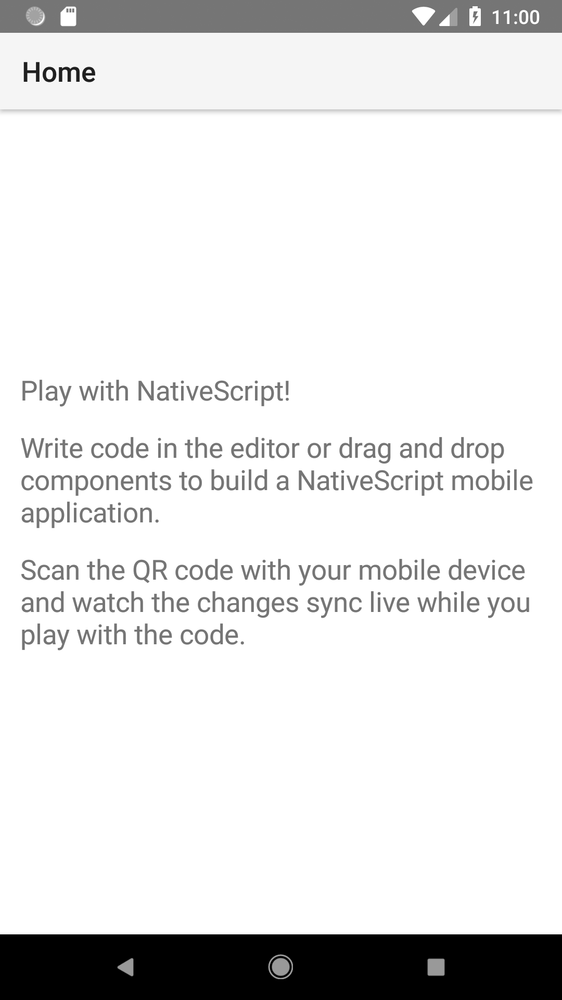

## Lesson 1. Getting Familiar with the Playground

Welcome to the NativeScript-Vue getting started guide. In this first lesson, you’ll learn how to use this Playground environment and how to get your first NativeScript-Vue app on your device.

> **TIP**:
> * If you run into problems with this tutorial, the [#vue channel in the NativeScript Community Slack](https://developer.telerik.com/wp-login.php?action=slack-invitation) is a great place to reach out for help.
> * This tutorial pane is collapsible and adjustable. Play around with its size until you find a width that works for you.

### Step 1. The lay of the land

Right now, you're in the NativeScript Playground.

This is a browser-based environment for developing simple NativeScript apps, using any of the available integrations. You can get straight to coding without installing the various SDKs and tools needed for native iOS and Android development. All you need to complete this guide is an iOS or Android device.

Let’s see the NativeScript Playground in action.

#### Action

* **а.** Look around the screen.

The left sidebar offers a file explorer and a **Components** panel. Most of the effort on your app will happen in `components` > `HelloWorld.vue`, where you'll be creating the user interface and the business logic behind it. No need to deep dive in any other files for now.

* **b.** Check out the **Components** panel.

The **Components** panel provides quick access to already pre-configured code for all available NativeScript UI components. The search box provides a shortcut to reaching the component you want to use without scrolling through the list.

You can quickly add components to your app with drag-and-drop.

* **c.** Examine the top menu bar.

From the top of the page, you can push changes to the preview apps on your device (more about those later), save, and download your code.

* **d.** Get familiar with the bottom of the page.

The bottom of the page is your best friend, providing real-time error reports and device logs.

### Step 2. Get all the tools

If this is your first time here, the Playground might have already prompted you to install a couple of mobile apps&mdash;the NativeScript Playground and the NativeScript Preview. Together they let you see your code changes applied in real time on device. No code building and bundling required.

You can ignore this step but without it, you'll miss most of the fun and excitement of playing around with Vue.js and NativeScript.

Keep the apps running while you're experimenting with the code.

#### Action

* **a.** Bring out your Android or iOS device. You need at least one device to complete this tutorial.

* **b.** Download and install the **NativeScript Playground** app on your device by either searching for “NativeScript Playground” in the App Store or Google Play, or by using the links below.

* **c.** Download and install the **NativeScript Preview** app on your device by either searching for “NativeScript Preview” in the App Store or Google Play, or by using the links below.

* **d.** Run the **NativeScript Playground** app on your device and tap **Scan QR code**.

* **e.** In your web browser, click **QR Code** in the top menu bar of the Playground.

* **f.** Use your device to scan the QR code from your browser. You should see an app that looks like the screenshots below.

