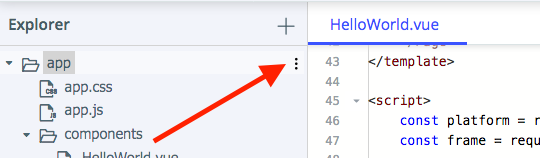

## Lesson 11. A few masterful touches on iOS

### Step 24. Access the `platform` and the `frame` modules

In this lesson, you'll learn how to perform platform checks and tie platform-specific logic and design to them.

* You will improve the look and feel of the `<ActionBar>`.
* You will tweak the keyboard on iOS.
* You will add iOS-specific icons in the `<TabView>`.

The core `platform` module lets you get device-specific information such as device model, type, OS and OS version, language, manufacturer, and screen information. It lets you perform OS checks and implement platform- and device-specific functionality that depends on the these checks.

You will later use the `frame` to access the iOS native component behind the `<ActionBar>` and change its style and color.

To tap into the powers of these modules, you need to require them explicitly in your code.

<hr data-action="start" />

#### Action

* **a.** In `HelloWorld.vue` > `<script>`, require the `platform` and the `frame` module. Place these statements at the top of the block before the `export` statement.

```JavaScript
const platform = require("tns-core-modules/platform");
const frame = require("tns-core-modules/ui/frame");
```

<hr data-action="end" />

### Step 25. Improve the looks of the `<ActionBar>` on iOS

Note how the status bar at the top of the screen combines a dark label on a dark background for iOS. You can change this with a simple platform-specific tweak. Use the `platform.isIOS` check to run the configuration change only on iOS. Next, apply a specific iOS status bar setting.

<hr data-action="start" />

#### Action

* **a.** In the `methods` section of the `<script>` block, add a `onPageLoaded` method at the top and create a simple `platform.isIOS` check. You will use it to manage iOS-specific changes as soon as the app screen loads.

```JavaScript
onPageLoaded() {
    if (platform.isIOS) { 

    }
},
```

* **b.** Call this method in the `@loaded` event for the `<Page>` component in your `<template>` block.

```HTML
<Page class="page" @loaded="onPageLoaded">
```

* **c.** Use the `frame` module to access the native iOS status bar and change its style. One of NativeScript’s most compelling features is that you can access all iOS and Android APIs directly from your code. This step relies on accessing the native `UIBarStyle.UIBarStyleBlack` API. For more information about how this works, see [100% Native API Access](https://www.nativescript.org/native-api-access).


```JavaScript
onPageLoaded() {
    if (platform.isIOS) {
        const navBar = frame.topmost().ios.controller.navigationBar;
        navBar.barStyle = UIBarStyle.UIBarStyleBlack;
    }
},
```

* **d.** Tweak the looks of the iOS keyboard by hiding the auto toolbar. For more information about how this works, see [the NativeScript IQKeyboardManager plugin](https://github.com/tjvantoll/nativescript-IQKeyboardManager), which is installed by default in all NativeScript Playground apps.

```JavaScript
IQKeyboardManager.sharedManager().enableAutoToolbar = false;
```

<hr data-action="end" />

At the end of this step, your `onPageLoaded` method should resemble this sample:

```JavaScript
onPageLoaded() {
    if (platform.isIOS) {
        const navBar = frame.topmost().ios.controller.navigationBar;
        navBar.barStyle = UIBarStyle.UIBarStyleBlack;
        IQKeyboardManager.sharedManager().enableAutoToolbar = false;
    }
},
```

### Step 26. Import iOS-specific icons

You can add images to use inside your app with a few clicks. Upload iOS-specific icons that you can later use to improve the look of your navigation tabs.

<hr data-action="start" />

#### Action

* **a.** Download [this icon archive](https://github.com/NativeScript/playground-tutorials/blob/master/getting-started-vue/images/icons.zip?raw=true) locally and unpack it.

* **b.** Point to the `app` folder and click the more options button at the far right of its line.



* **c**. Select **Add folder** and name the new folder `images`.

* **d.** Point to the newly created `images` folder and click the more options button at the far right of its line. Select **Upload** resources.

* **e.** Click **Browse**, navigate to the location that contains your icons. Select and upload all images in the `icons` folder you just downloaded.

<hr data-action="end" />

### Step 27. Prettify your `<TabView>` on iOS with the newly imported icons

Spruce up your design by creating some iOS-specific functionality. You can use the `platform.isIOS` and `platform.isAndroid` flags to trigger platform-specific functionality.

<hr data-action="start" />

#### Action

* **a.** Show an icon for active tasks in the `<TabView>` for iOS. 

To check if the app is running on an iOS device, use the `platform.isIOS` check. Place the check and the logic behind it in the `data` section of the `<script>` block of your `HelloWorld.vue` file.

```JavaScript
todoIcon: platform.isIOS ? "~/./images/To-Do@3x.png" : "",
```

* **b.** To show the icon on the screen, modify the `<TabViewItem>` definition for the active tasks tab in the `<template>` block.

```HTML
<TabViewItem title="To Do" :iconSource="todoIcon" textTransform="uppercase">
```

* **c.** Show an icon for completed tasks in the `<TabView>` for iOS. Place an identical `platform.isIOS` check to the one you created in the previous step in the `data` section of the `<script>` block of your `HelloWorld.vue` file.

```JavaScript
completedIcon: platform.isIOS ? "~/./images/Completed@3x.png" : ""
```

* **d.** To show the icon on the screen, modify the `<TabViewItem>` definition for the completed tasks tab in the `<template>` block.

```HTML
<TabViewItem title="Completed" :iconSource="completedIcon" textTransform="uppercase">
```

<hr data-action="end" />

### Step 28. Prevent highlighting of tapped items

Add a method that changes the default selection style on iOS to both `<ListView>` components. By default, when you tap an item in a list view on iOS, the item is highlighted.

<hr data-action="start" />

#### Action

* **a.** In the `<script>` block, create a new `onItemLoading` method that changes the selection style for iOS. (You can read more about what this line of code is doing on [this Stack Overflow thread](https://stackoverflow.com/questions/46299915/remove-listview-item-highlight-on-tap-nativescript-angular-ios).)

```JavaScript
onItemLoading(args) {
  if (args.ios) {
    args.ios.selectionStyle = UITableViewCellSelectionStyle.None;
  }
},
```

* **b.** Bind the method to the `@itemLoading` event listener in both `<ListView>` components of your app.

```HTML
<ListView row="2" for="todo in todos" @itemLoading="onItemLoading">
```

```HTML
<ListView row="1" for="done in dones" @itemLoading="onItemLoading">
```
<hr data-action="end" />